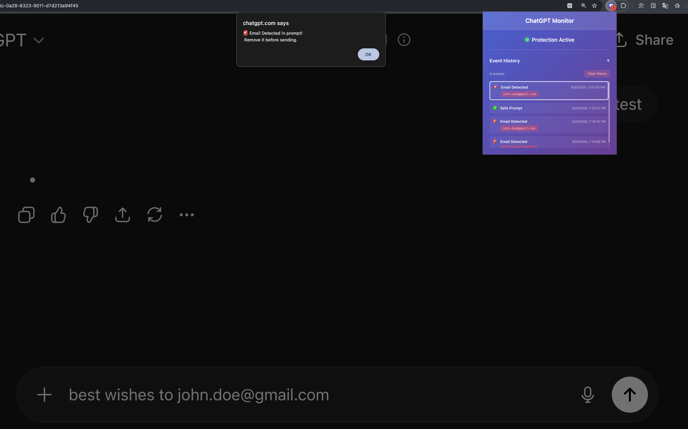

# ChatGPT Monitor - Experimental Chrome Extension



A Chrome browser extension that monitors ChatGPT conversations and alerts users when email addresses are detected in prompts, helping prevent accidental sharing of sensitive personal information.

## Features

- **Real-time Email Detection**: Monitors text input in ChatGPT prompts for email addresses
- **Visual Alerts**: Shows browser badge notifications and popup alerts when emails are detected
- **Event History**: Tracks and displays a history of detection events
- **Prevention Mechanism**: Blocks prompt submission when emails are detected
- **Persistent Storage**: Maintains event history using Chrome's local storage

## How It Works

The extension operates through three main components:

1. **Content Script**: Monitors the ChatGPT textarea and submit button for email patterns
2. **Background Script**: Manages browser badge notifications and message handling
3. **Popup Interface**: React-based UI with context-managed state for status display and event history

When an email address is detected in a ChatGPT prompt, the extension:
- Prevents the prompt from being submitted
- Shows an alert dialog to the user
- Updates the browser badge with a warning indicator
- Logs the event to the history

## Technology Stack

- **Frontend**: React 19 with TypeScript
- **State Management**: React Context API for event history
- **Build Tool**: Webpack 5
- **Extension API**: Chrome Extension Manifest V3
- **Storage**: Chrome Storage API
- **Styling**: CSS with custom components
- **Development**: ESLint, Prettier, TypeScript compiler

## Installation

### From Source

1. Clone the repository:
   ```bash
   git clone <repository-url>
   cd secure-browser
   ```

2. Install dependencies:
   ```bash
   npm install
   ```

3. Build the extension:
   ```bash
   npm run build
   ```

4. Load in Chrome:
   - Open Chrome and navigate to `chrome://extensions/`
   - Enable "Developer mode"
   - Click "Load unpacked" and select the `dist` folder

## Development

### Prerequisites
- Node.js (version that supports React 19)
- Chrome browser
- npm or yarn

### Development Commands

```bash
# Start development with file watching
npm run dev

# Build for production
npm run build

# Run linting
npm run lint

# Fix linting issues
npm run lint:fix

# Format code
npm run prettier

# Type checking
npm run typecheck
```

### Project Structure

```
src/
├── background/          # Background service worker
│   ├── index.js        # Main background script
│   └── badge-helper.js # Badge notification utilities
├── content/            # Content script for ChatGPT monitoring
│   ├── index.js       # Content script entry point
│   └── chat-gpt-text-monitor.ts # Main monitoring logic for chatgpt prompts
├── popup/             # Extension popup interface
│   ├── App.tsx       # Main React app component
│   ├── index.tsx     # Popup entry point
│   ├── StatusDisplay.tsx # Status display component
│   └── history/      # Event history components
│       ├── EventHistory.tsx # History list component
│       ├── EventHistoryContext.tsx # Context provider for state management
│       └── HistoryItem.tsx # Individual history item component
├── shared/           # Shared utilities and types
│   ├── action-types.ts # TypeScript type definitions for extension events
│   └── html-helpers.js # DOM text extraction helpers
└── assets/          # Static assets
```

### Development Workflow

1. Make changes to source files
2. Run `npm run dev` for automatic rebuilding
3. Reload the extension in Chrome extensions page
4. Test functionality on ChatGPT
5. Run `npm run lint` and `npm run typecheck` before committing

## Configuration

The extension targets ChatGPT at `https://chatgpt.com/*` and requires the following permissions:
- `activeTab`: To monitor the current ChatGPT tab
- `storage`: To persist event history

## Browser Support

- Chrome 88+ (as specified in browserslist configuration)
- Uses Manifest V3 for Chrome extension compatibility

## Security & Privacy

- All monitoring happens locally in the browser
- No data is sent to external servers
- Event history is stored locally using Chrome's storage API
- Only monitors text input on ChatGPT domain
